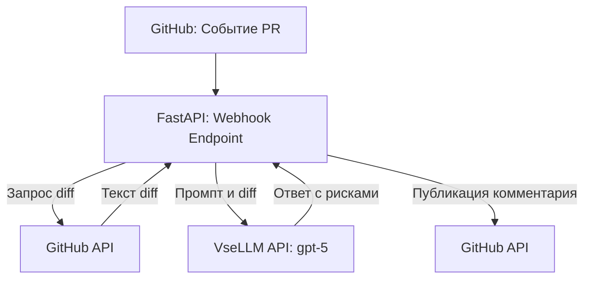

# ADR: решение для первого рабочего сценария

Файл ведёт OpenCode. Обсудите с агентом содержание и проверьте предложенный diff. Все дополнения и исправления поручайте агенту в чате.

- Статус: accepted
- Дата: 2026-09-20
- Ответственные: OpenCode / Студент

## Контекст

Команда из 6 бэкенд-разработчиков (стек Python/FastAPI) тратит много времени на рутинное ревью PR. Для ускорения первого ревью было решено внедрить AI-помощника, который должен анализировать diff и находить базовые ошибки (валидация, тесты), работая с одобренным LLM-провайдером VseLLM.

## Решение

Создание отдельного легковесного микросервиса на базе **FastAPI**. Сервис будет принимать Webhook-события от GitHub при открытии или обновлении PR, запрашивать diff через GitHub API, формировать промпт, отправлять запрос в VseLLM и публиковать структурированный ответ от LLM обратно в GitHub в виде комментария к PR.

## Рассмотренные альтернативы

| Альтернатива | Почему не выбрали сейчас |
|---|---|
| Скрипт внутри GitHub Actions | Сложнее локально отлаживать, труднее централизованно управлять промптами и собирать статистику (метрики). |
| Очереди задач (Celery/RabbitMQ) | Избыточная сложность для первой версии и небольшой команды из 6 человек. |
| Готовые SaaS-решения для AI-ревью | Нарушают требования безопасности (код разрешено отправлять только в корпоративный VseLLM). |

## Последствия и главный риск

- Положительные последствия: Быстрый запуск, простота разработки (используется знакомый команде стек Python/FastAPI), полный контроль над процессом и данными.
- Ограничения: Требуется хостинг для развертывания постоянно работающего сервиса, обрабатывающего вебхуки.
- Главный риск: Таймаут GitHub Webhook (обычно около 10 секунд). Если LLM будет генерировать ответ долго, GitHub может прервать соединение с ошибкой.
- Как проверим риск: Сделаем интеграционный тест с моком LLM, имитирующим долгий ответ. Если проблема проявится, перенесем логику обращения к LLM в `BackgroundTasks` FastAPI.

## Архитектурная схема

## Как использовали AI

- Для чего: Формирование архитектурного решения (ADR) для сервиса-помощника.
- Тип промпта: Диалог в режиме Build.
- Строка в [`prompts.md`](prompts.md): -
- Что проверил студент и какие исправления поручил агенту: Студент подтвердил предложенную агентом архитектуру (FastAPI + Webhook) и отбраковку альтернатив без изменений.
