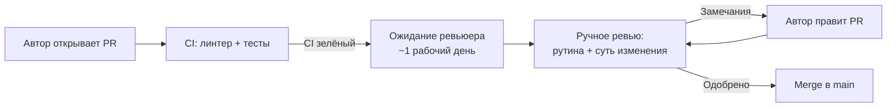
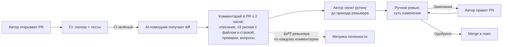

# Анализ процесса: AS IS и TO BE

Файл ведёт OpenCode. Обсудите с агентом содержание и проверьте предложенный diff. Все дополнения и исправления поручайте агенту в чате.

## AS IS

Текущий процесс ревью PR в команде (6 бэкенд-разработчиков, GitHub + GitHub Actions; легенда согласована в [`context.md`](context.md)):

Участники, задержки и потери:

- **Участники:** автор PR, ревьюер (коллега по команде), CI (GitHub Actions).
- **Задержка 1 — ожидание:** первое ревью PR ждёт в среднем 1 рабочий день; автор в это время блокирован или переключает контекст.
- **Задержка 2 — итерации:** рутинные проблемы (валидация входа, обработка ошибок, отсутствие тестов) находит человек; каждый такой цикл «замечание → правка → повторное ревью» добавляет часы или день. Медиана 2–3 итерации на PR.
- **Ручные операции:** ревьюер вручную ищет типовые проблемы до того, как перейти к сути изменения; это время сеньоров, потраченное на рутину.
- **Точка потери информации:** часть мелких ошибок проходит ревью и доходит до main; замечания в PR не накапливаются в проверяемые правила.

## TO BE

Тот же процесс после внедрения AI-помощника ревьюера (нотация BPMN-подобная, Mermaid flowchart; GitHub рендерит её нативно):

Ключевые свойства TO BE:

- Помощник срабатывает автоматически после открытия PR и зелёного CI; человек ничего не запускает вручную.
- Комментарий приходит за минуты (цель ≤ 2 часов против ~1 дня): автор успевает починить рутину до прихода ревьюера.
- Решение по PR по-прежнему принимает человек: помощник не делает approve, merge и не меняет код (границы из [`context.md`](context.md)).
- Каждый риск проверяем (файл, строка, доказательство, шаг проверки) — ревьюер может подтвердить или отклонить его за минуты.
- Реакции 👍/👎 на комментарии дают метрику полезности (цель ≥ 70%, см. [`problem.md`](problem.md)).

## Разница

| Что меняется | AS IS | TO BE | Как проверим изменение |
|---|---|---|---|
| Первая обратная связь по PR | Ручное ревью через ~1 рабочий день | Комментарий помощника ≤ 2 часов после открытия PR | GitHub API: время между открытием PR и первым комментарием |
| Поиск рутинных проблем | Вручную ревьюером | Автоматически помощником до ручного ревью | Разметка комментариев по выборке 30 PR: кто первым нашёл рутинную проблему |
| Число итераций ревью | Медиана 2–3 цикла на PR | Медиана ≤ 2 (рутина исправлена до ревьюера) | GitHub API: число раундов review на PR за месяц |
| Фокус ревьюера | Рутина + суть вперемешку | Суть изменения; рутина уже отработана | Опрос команды + доля рутинных замечаний от человека (−50%) |
| Контроль качества помощника | — | Реакции 👍/👎 на каждый комментарий | Доля 👍 ≥ 70% еженедельно |

## Как использовали AI

- Для чего: описать AS IS и TO BE процесса ревью и таблицу различий на основе согласованной легенды и метрик.
- Тип промпта: диалог в режиме Build; входные факты — [`context.md`](context.md) (процесс, участники) и [`problem.md`](problem.md) (метрики, границы).
- Строка в [`prompts.md`](prompts.md): P1-01 и P1-02 — сравнение запусков показало, какие шаги процесса закрывает помощник (рутина, проверяемые риски) и где остаётся человек.
- Что проверил студент и какие исправления поручил агенту: студент проверил диаграммы AS IS / TO BE и таблицу различий, принял без правок.
