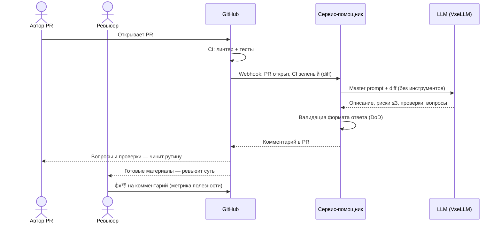

# Use cases и user stories

Файл ведёт OpenCode. Обсудите с агентом содержание и проверьте предложенный diff. Все дополнения и исправления поручайте агенту в чате.

## Первый рабочий сценарий

**Когда** автор открывает PR и CI проходит успешно, **система** передаёт diff AI-помощнику и публикует его комментарий в PR, **а пользователь получает** за ≤ 2 часов структурированный комментарий: описание изменения, не больше трёх рисков с файлом, строкой и доказательством, список проверок и вопросы к автору.

Не входит в этот сценарий:

- approve, merge или автоматическое изменение кода;
- ревью более одного PR за запуск;
- анализ файлов репозитория за пределами diff;
- повторный запуск при обновлении PR (отдельный сценарий следующего инкремента).

## Use case

| Поле | Значение |
|---|---|
| Актор | Ревьюер PR (основной), автор PR (получает вопросы и проверки) |
| Триггер | PR открыт, CI (линтер + тесты) завершился успешно |
| Предусловия | Diff PR доступен через GitHub API; LLM-провайдер (VseLLM) доступен; master prompt сконфигурирован |
| Основной результат | Комментарий в PR из четырёх разделов (описание, риски ≤ 3, проверки, вопросы) в течение 2 часов |
| Ошибка или отказ | Diff пуст, обрезан или превышает лимит — помощник публикует один вопрос о проблеме входа; LLM недоступен — комментарий не публикуется, ошибка в лог, ревью идёт по AS IS |



## User stories и acceptance criteria

- **US-1.** Как ревьюер, я хочу получать по каждому PR не больше трёх доказанных рисков с файлом и строкой, чтобы проверять их за минуты, а не искать рутину вручную.
- **US-2.** Как автор PR, я хочу получить комментарий с проверками и вопросами в течение 2 часов после открытия PR, чтобы исправить рутинные проблемы до прихода ревьюера.
- **US-3.** Как ревьюер, я хочу отмечать комментарии помощника 👍/👎, чтобы команда видела его полезность и настраивала промпт.

```gherkin
Feature: AI-помощник ревьюера публикует комментарий по diff PR

  Scenario: Позитивный — PR с типовой проблемой
    Given PR открыт и CI прошёл успешно
    And diff содержит обращение payload["diff"] без проверки ключа
    When сервис-помощник передаёт master prompt и diff в LLM
    Then в PR появляется комментарий из четырёх разделов
    And раздел "Риски" содержит от 1 до 3 пунктов
    And риск про KeyError указывает файл app/api.py и строку из diff
    And каждый риск содержит воспроизводимый шаг проверки
    And комментарий опубликован не позже чем через 2 часа после открытия PR

  Scenario: Негативный — пустой или повреждённый diff
    Given PR открыт и CI прошёл успешно
    And diff пуст или обрезан
    When сервис-помощник передаёт master prompt и diff в LLM
    Then помощник не публикует рисков
    And в PR появляется один вопрос с описанием проблемы входа
    And сервис не вызывает approve, merge или изменение кода

  Scenario: Граничный — LLM-провайдер недоступен
    Given PR открыт и CI прошёл успешно
    When вызов LLM завершается ошибкой или таймаутом
    Then комментарий в PR не публикуется
    And ошибка записывается в лог сервиса
    And процесс ревью продолжается как в AS IS без блокировки PR
```

## Как использовали AI

- Для чего: сформулировать первый рабочий сценарий, use case с sequence-диаграммой, user stories и gherkin-сценарии по согласованной легенде.
- Тип промпта: диалог в режиме Build; входы — [`context.md`](context.md) (Context Pack, формат результата), [`problem.md`](problem.md) (метрики), [`analysis.md`](analysis.md) (TO BE).
- Строка в [`prompts.md`](prompts.md): P1-02 — формат комментария и поведение при плохом входе взяты из Master Prompt v1 и проверены запуском.
- Что проверил студент и какие исправления поручил агенту: студент проверил сценарий, use case, sequence-диаграмму и gherkin-сценарии, принял без правок; отдельно уточнил корректность отображения Mermaid/gherkin на GitHub.
