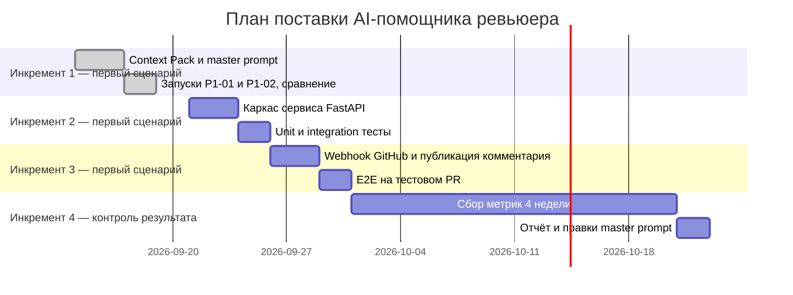

# План поставки

Файл ведёт OpenCode. Обсудите с агентом содержание и проверьте предложенный diff. Все дополнения и исправления поручайте агенту в чате.

## Инкременты и ответственность

Инкременты 1–3 реализуют первый рабочий сценарий из [`product_management.md`](product_management.md) (комментарий помощника в PR); инкремент 4 — контроль результата: он проверяет, что сценарий действительно двигает метрики из [`problem.md`](problem.md).

| Инкремент | Наблюдаемый результат | Что делает человек | Что делает AI или субагент | Проверка | Зависимости |
|---|---|---|---|---|---|
| 1. Master prompt и baseline | Два воспроизводимых запуска на `TRAINING_PR.diff`: zero-shot и master prompt; журнал сравнения | Ставит задачу, оценивает ответы, согласует Context Pack и границы | LLM ревьюит diff в изолированном запуске; рабочий агент ведёт файлы и журнал | `make step1`; строки P1-01/P1-02 в [`prompts.md`](prompts.md) | — |
| 2. Сервис-обвязка | Сервис принимает diff по HTTP и возвращает комментарий из четырёх разделов | Ревьюит код и тесты, принимает решения по ошибкам (422/лог/фолбэк) | Кодинг-агент генерирует каркас FastAPI, unit/integration-тесты по [`tests_unit.md`](tests_unit.md), [`tests_integration.md`](tests_integration.md) | `pytest`; gherkin-сценарии из [`product_management.md`](product_management.md) проходят вручную | Инкремент 1 (master prompt зафиксирован) |
| 3. Интеграция с GitHub | Комментарий появляется в реальном PR после зелёного CI; реакции 👍/👎 собираются | Настраивает webhook и секреты, следит за первыми PR, размечает полезность | Сервис автоматически обрабатывает webhook и публикует комментарий; агент готовит E2E-чеклист по [`tests_e2e.md`](tests_e2e.md) | E2E-сценарий на тестовом PR; время до комментария ≤ 2 ч | Инкремент 2 |
| 4. Замер метрик (контроль результата) | Отчёт по метрикам из [`problem.md`](problem.md) за 4 недели | Интерпретирует метрики, решает о правках master prompt | Скрипт собирает данные GitHub API (время до ревью, итерации, доля 👍) | Сверка отчёта с целями: ≤ 2 ч, итерации ≤ 2, 👍 ≥ 70% | Инкремент 3 |

Роли постоянны во всех инкрементах: решение о merge PR всегда принимает человек; AI готовит материалы и черновики, человек ревьюит каждый diff (правило из [`context.md`](context.md)).

## Диаграмма Ганта

## Как использовали AI

- Для чего: разбить поставку на инкременты с наблюдаемыми результатами, разделить роли человека и AI, построить план в Mermaid gantt.
- Тип промпта: диалог в режиме Build; входы — [`analysis.md`](analysis.md) (TO BE), [`problem.md`](problem.md) (метрики и сроки замера), [`context.md`](context.md) (границы AI).
- Строка в [`prompts.md`](prompts.md): P1-01, P1-02 — инкремент 1 уже выполнен этими запусками, его строка помечена done в диаграмме.
- Что проверил студент и какие исправления поручил агенту: студент указал на смешение масштабов «первый рабочий сценарий» и «план поставки продукта»; согласован вариант с явной разметкой — инкременты 1–3 реализуют первый сценарий, инкремент 4 помечен как контроль результата.
